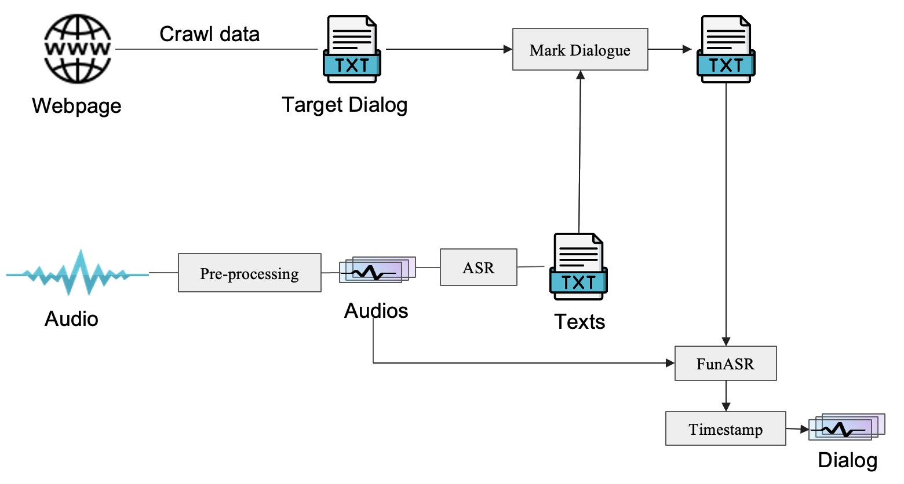

# DialogExtractor
DialogExtractor is a specialized tool designed to extract emotionally rich dialogues from audiobooks of novels. This project stems from the need to enhance Text-to-Speech (TTS) systems by providing them with high-quality, emotion-laden audio data, which is crucial for creating more expressive and realistic speech outputs.

## Overview
Traditional TTS systems can usually only synthesize simple emotions such as happiness and sadness. However, complex emotions in real life, such as bitterness and sadness, are difficult to control through text prompts, and there is even a lack of relevant data sets. To this end, DialogExtractor constructs an emotionally rich audio database by accurately extracting the dialogues of characters in rich audio novels. By leveraging this tool, developers can significantly improve the emotional responsiveness of their TTS applications, making them more attractive and realistic. The whole process is shown in the figure below:



## Challenges

1. Accurate positioning of character dialogues: Since it is difficult to mark " " with current ASR technology, it is difficult to determine the location of dialogues only through audio files. To this end, we first extract all the dialogues from the novel text content, and then mark the audio text extracted by ASR to determine the location of the dialogues.

2. Extraction of dialogue audio: We need to determine which parts of an audio are dialogues and extract them accurately. To do this, we use FunASR to timestamp and then extract them.

3. Audio filtering: After extraction, some dialogues may be too short to be used, so we need to filter the audio again.

## How to use it

### Create the Env:
```
conda create -n name python=3.9
conda activate name
pip install -r requirements.txt
```

### Get Dialog From Webpage:

In this step, you need to extract the dialogues of the characters based on the HTML code of the page where your target novel is located. Here, we take [https://m.xbiqugew.com/](Biquge) as an example to crawl the dialogues of the novel. The parameters that need to be changed are: 1. Web link. 2. Start page. 3. End interface. 4. Crawl location.

```
python get_web.py
```

### Preprocessing

Due to a series of issues such as data format, audio length, etc., the audio data needs to be initially screened.

```
python mp3twav.py
python delnonewav.py
python cut.py
```

### ASR

Perform ASR processing on all audio and identify the corresponding text.
```
cd asr
python asr.py
```

### Filtering

Filter out text containing dialogue.

```
python get_d.py
```

### Crop audio

The original audio is trimmed to obtain the character dialogue.

```
python cutaudio.py
```
